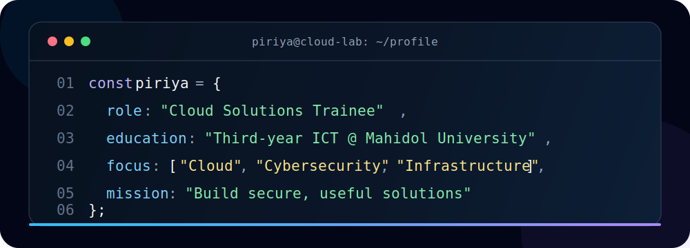

  

<h3 align="center">Third-year ICT Student · Cloud Solutions Trainee · Cybersecurity Enthusiast</h3>

  
  
  

## About Me

I'm **Piriya Tharatum**, a third-year ICT student at **Mahidol University** and a **Cloud Solutions Trainee at NTT DATA**. My work sits at the intersection of cloud computing, cybersecurity, networking, and software development.

I enjoy turning technical requirements into practical solutions—whether that means designing cloud architectures, assessing security risks, automating a workflow, troubleshooting a network, or building a web application. I am especially interested in **cloud security, penetration testing, infrastructure, and AI-assisted development**.

## What I Can Do

| Area | Capabilities |
| --- | --- |
| ☁️ **Cloud & Infrastructure** | Design and explain cloud architectures, work with AWS and Azure services, define infrastructure with Terraform, and review IAM, API, CORS, cost, and security boundaries. |
| 🛡️ **Cybersecurity** | Apply vulnerability-assessment and penetration-testing fundamentals, examine network and endpoint risks, and work with incident-response and OT-security concepts. |
| 💻 **Software Development** | Build responsive web interfaces and small full-stack applications, process CSV/XLSX data, integrate REST APIs, and create practical automation with Python and PowerShell. |
| 🌐 **Networking & Support** | Work with TCP/IP fundamentals, Cisco Packet Tracer, MikroTik RouterOS, structured cabling, multi-OS troubleshooting, and network configuration. |
| 🤖 **AI-Assisted Solutions** | Prototype with Amazon Bedrock, Vertex AI, and Gemini CLI; use AI tools to support web development, technical research, and documentation. |

## Technologies & Tools

### Cloud, Infrastructure & AI

  

`Amazon Bedrock` · `Vertex AI` · `Gemini CLI` · `AWS Lambda` · `Amazon S3` · `CloudFront` · `IAM`

### Programming & Web Development

  

### Developer, Network & Creative Tools

  

  
  
  
  
  

## Experience

### Cloud Solutions Trainee · NTT DATA, Inc.

`Jun 2026 — Present` · Bangkok, Thailand · Hybrid

- Developing an **AWS EC2 Price Estimator** that transforms CSV/XLSX and RVTools inventory data into normalized VM requirements, compares EC2 pricing across Regions, and exports results to Excel.
- Working with a serverless architecture involving Amazon S3, CloudFront, AWS WAF, Lambda, Amazon Bedrock Agent, AWS pricing APIs, IAM, Terraform, and GitHub Actions.
- Reviewing cloud data flows, frontend/backend responsibilities, authentication, CORS, security boundaries, and cost optimization.
- Exploring Microsoft Azure and prototyping AI-assisted web experiences with Vertex AI and Gemini CLI.
- Writing beginner-friendly technical documentation for cloud and command-line workflows.

### Web Development & Technical Support

- Built and maintained websites for **MCT (Mintra Consultas)**, **Panya Esan Foundation**, and **JP Home Mart Co., Ltd.**
- Supported programming, robotics, and networking training; created technical and video content for learners and community projects.
- Collaborated on network systems and practical business solutions, including expense tracking, sales management, and POS workflows.

## Featured Projects

### AWS EC2 Price Estimator

An internship project that converts infrastructure inventory into comparable AWS EC2 recommendations and pricing results.

`AWS` `Amazon Bedrock` `JavaScript` `Node.js` `Terraform` `GitHub Actions` `Excel`

### MealCraft — Online Food Ordering Website

A team-built web application featuring menu discovery, search, shopping-cart, and ordering workflows. Developed with three teammates as a major university web-development project.

`HTML` `CSS` `JavaScript` `Teamwork` · [View project materials](https://drive.google.com/drive/folders/1QJpqfMFF9t2Emf88AwE3GjMu56KV9Xnh?usp=sharing)

### Scramber — English Word Game

A three-level English word-scramble game created by a four-person team to make language learning more engaging and accessible.

`Unity` `Adobe Photoshop` `Game Design` `Project Planning`

### Community & Business Web Solutions

Website, content, network, and operational support for training, community-development, and retail organizations in Ubon Ratchathani.

`Web Development` `Networking` `Technical Support` `Video Content`

## Education

🎓 **Mahidol University — Faculty of Information and Communication Technology**  
Bachelor's degree in Information and Communication Technology · Third-year student · `2023 — Present`

🏫 **Benchama Maharat School**  
Upper Secondary Education · Arts–French Program

## Selected Certifications

- **IT Specialist — Cybersecurity** · Certiport
- **HCIA–Cloud Computing V5.5** · Huawei ICT Academy
- **Cybersecurity Analyst, Cybersecurity Professional, OT Security & Penetration Test** · National Cyber Security Agency, Thailand
- **MTCNA** · MikroTik
- **Introduction to Networks & IT Essentials** · Cisco Networking Academy
- **Ethical Hacking Essentials, Digital Forensics Essentials & Network Defense Essentials** · EC-Council / Codered
- **Fortinet NSE 1 & NSE 3** · Fortinet

## Beyond Technology

🏆 **1st Place — “The Best Part of My Family” Video Competition**  
Selected as Ubon Ratchathani's provincial representative for the national-level competition. The project strengthened my teamwork, planning, storytelling, and creative problem-solving skills.

---

  <b>Building secure, useful, and thoughtfully engineered solutions.</b> 
  Open to learning, collaboration, and opportunities in cloud and cybersecurity.

<!-- Profile README redesigned from Piriya Tharatum's portfolio, July 2026 -->
